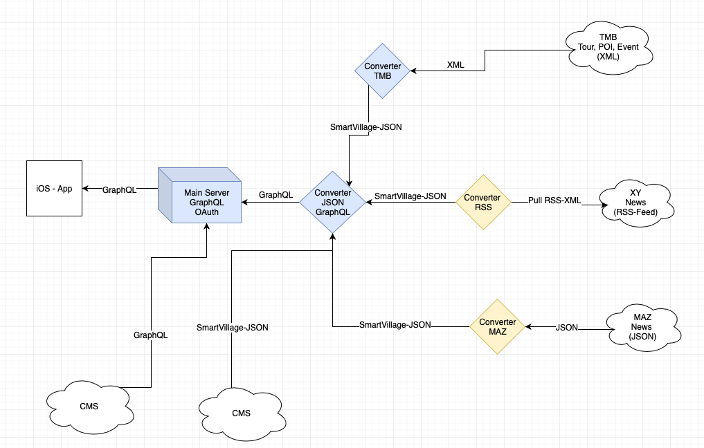

# Smart Village App Bad Belzig

Dieses Repo sammelt und dokumentiert das Projekt "Smart Village App Bad Belzig" und enthält vor allem Konzepte und Designs. Unter https://github.com/ikuseiGmbH/smart-village-app-swagger-api-specification finden sich die technischen Spezifikationen für die verschiedenen Schnittstellen.

Die eigentlichen Sourcecodes sind hier zu finden: 
- [Mobile App](https://github.com/ikuseiGmbH/smart-village-app-app)
- [Main-Server](https://github.com/ikuseiGmbH/smart-village-app-mainserver)
- [JSON to GraphQL Converter](https://github.com/ikuseiGmbH/smart-village-app-converter-json2graphql)
- [CMS](https://github.com/ikuseiGmbH/smart-village-api-cms)
- [TMB Converter](https://github.com/ikuseiGmbH/smart-village-app-converter-xml2json)
- [RSS-Importer](https://github.com/ikuseiGmbH/smart-village-app-rss-importer)
- [MAZ Converter](https://github.com/ikuseiGmbH/smart-village-app-maz-converter)

